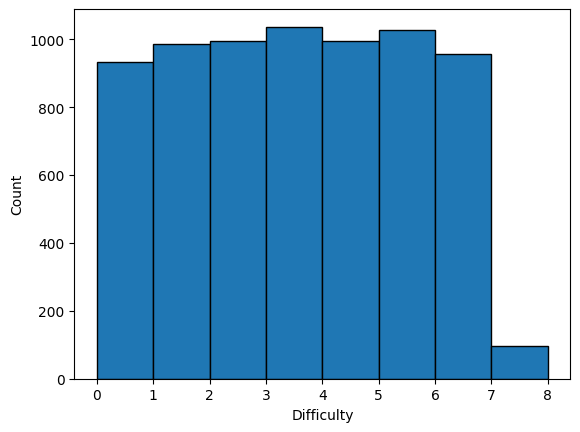
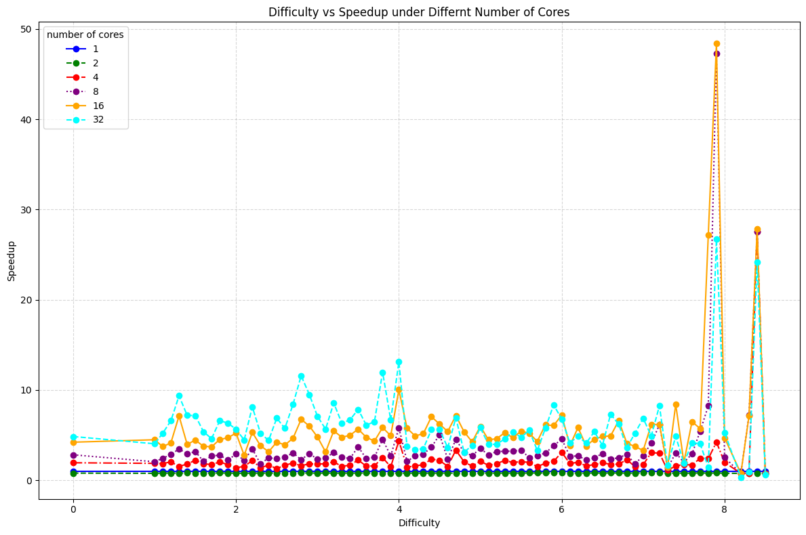
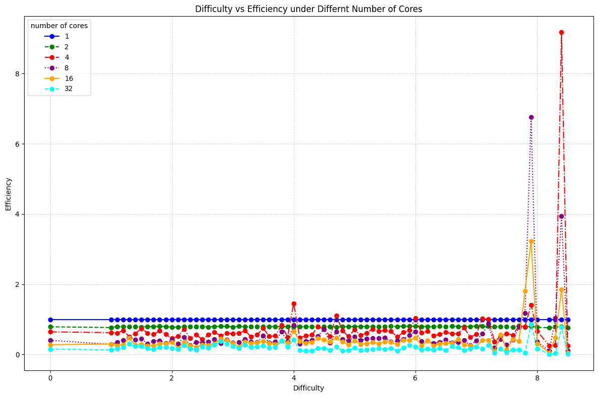

# ParallelSudoku (Umich Fall 2024 EECS587 Final Project)
Author: kirp@umich.edu

## Usage
- `bash download.sh` to download the benchmark.
- `run bash.sh` on Greatlake Server.
- [The report](results\EECS587_Sokudo_Solver_Final_Report.pdf) is in the results folder.

## Data distribution
We have sampled 7034 puzzles from the [Sodoku-3m dataset](https://www.kaggle.com/datasets/radcliffe/3-million-sudoku-puzzles-with-ratings). The following image shows the distribution of the difficulty.

## Result

