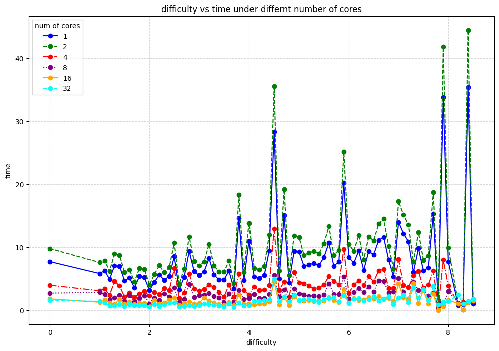
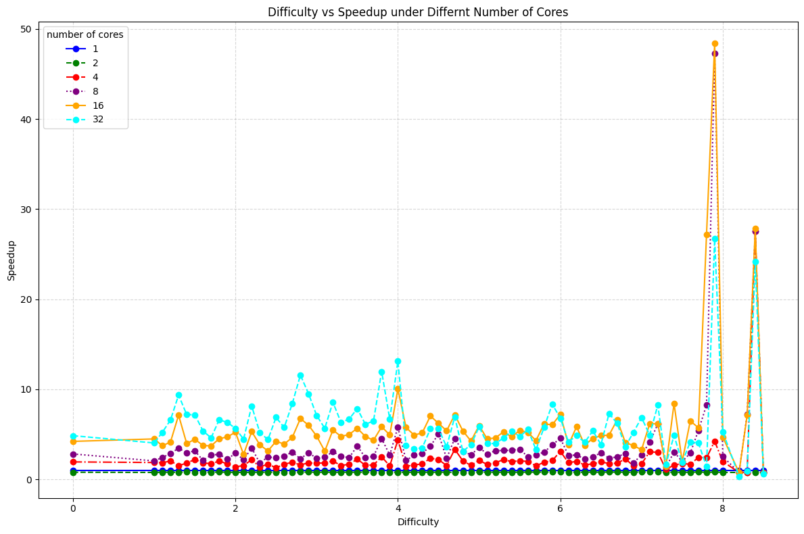
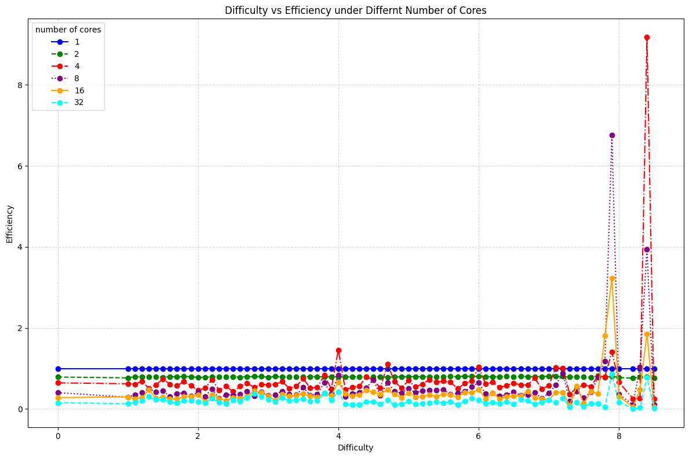

# ParallelSudoku
Fall 2024 EECS587 Final Project

Author: kirp@umich.edu

## Usage
`run bash.sh` on Greatlake Server.

## Data distribution
We have sampled 7034 from the [Sodoku-3m dataset](https://www.kaggle.com/datasets/radcliffe/3-million-sudoku-puzzles-with-ratings). You can download our benchmark with `bash download.sh`.

## Result

