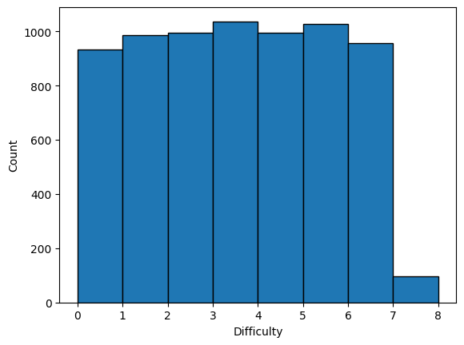
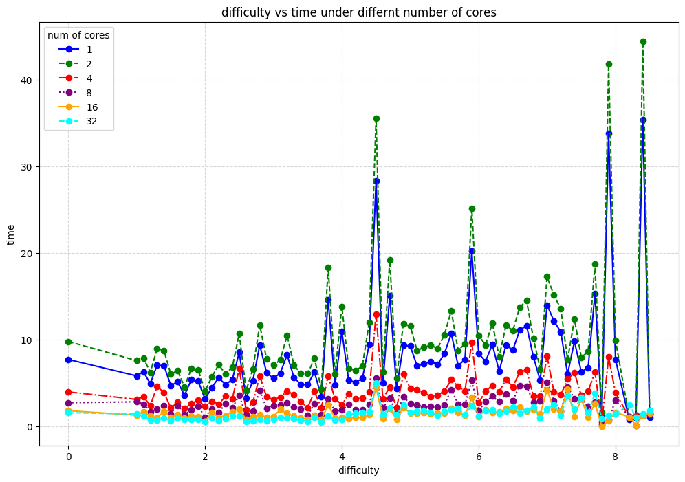

# ParallelSudoku
Fall 2024 EECS587 Final Project

Author: kirp@umich.edu

## Usage
`run bash.sh` on Greatlake Server.

## Data distribution
We have sampled 7034 from the Sodoku-3m dataset.

## Result

